

<!-- _class: title -->

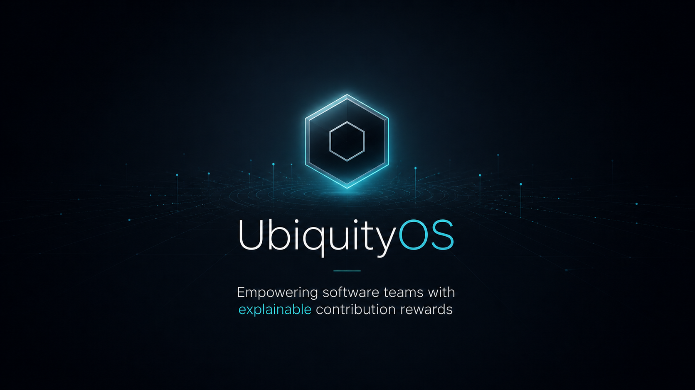

# UbiquityOS

Empowering software teams with explainable contribution rewards

---

# Problem

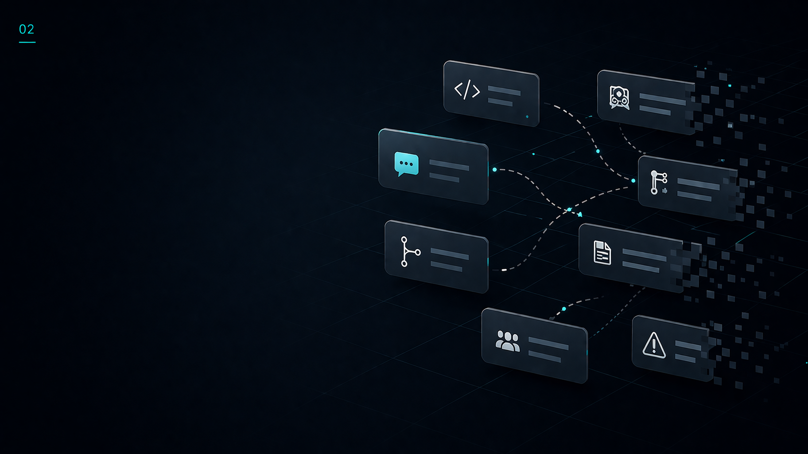

- Engineering work is no longer captured by commits alone
- Specifications, reviews, clarifications, and coordination drive delivery
- Slack and GitHub hold critical context, but it disappears into timelines
- Managers still rely on memory, anecdotes, and incomplete dashboards

Enterprises need contribution accounting, not developer surveillance.

---

# Why Now

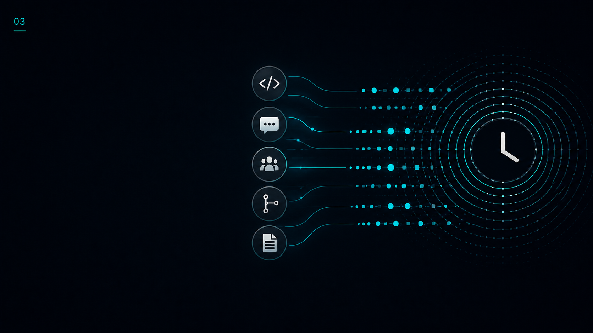

- AI increases code volume, but code volume is not engineering value
- Distributed teams create more async work across more tools
- Review quality and coordination now determine whether AI output is usable
- Finance and operations need defensible payout records for contributors and contractors

---

# Solution

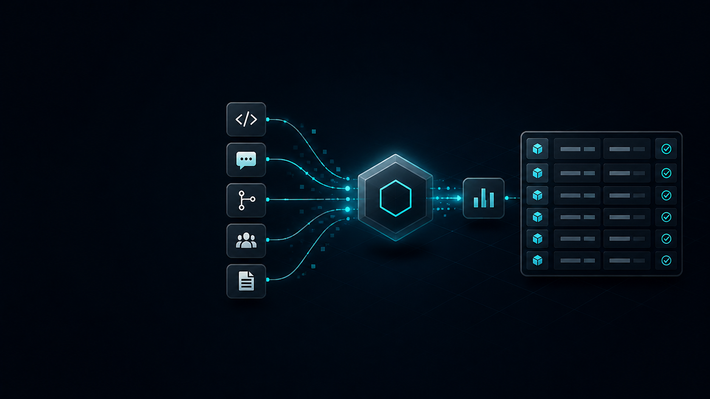

UbiquityOS turns engineering artifacts into an auditable XP ledger.

- Capture work from GitHub events
- Score useful contribution with configurable policy
- Attach every point to source evidence
- Persist XP or generate claimable rewards
- Expand into Slack, Jira, Linear, and other work surfaces

  
Contribution Output

  

    
Work

Count

Score

Reward

    
Specification

1

1.00

12.4

    
Issue comment

8

0.83

18.8

    
Code review

3

priority 2

24.0

    
Simplification

4 files

net -210

2.1

  

---

# Product Promise

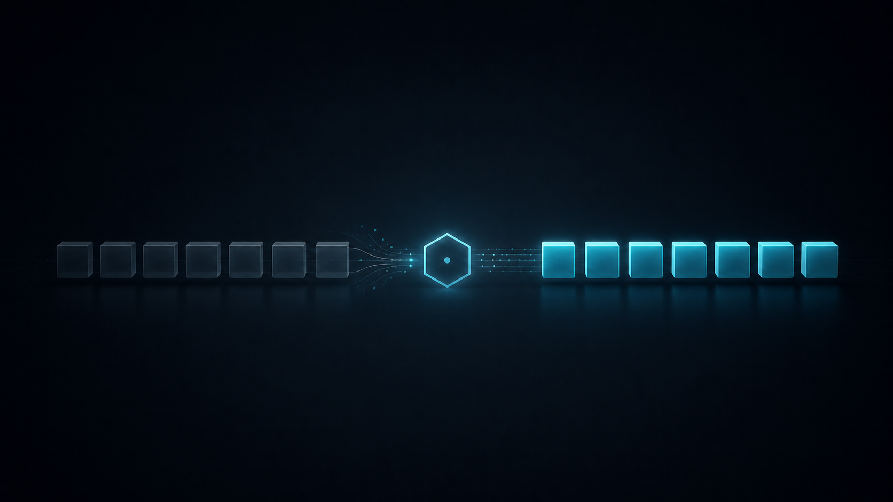

  
One useful unit of work in, one point out.

  
Every point should explain who contributed, what was recognized, where the evidence lives, and why the work counted.

---

# How It Works

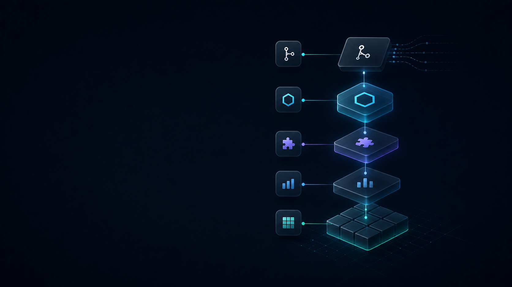

- UbiquityOS kernel relays GitHub events
- Contribution Rewards plugin collects issue, PR, review, and comment evidence
- Modules evaluate formatting, relevance, priority, authorship, review impact, and simplification
- Results are posted back to GitHub and stored as XP or payment records

  
GitHub event

  
UbiquityOS kernel

  
Contribution Rewards plugin

  
Evidence scoring

  
XP or reward ledger

---

# What Works Today

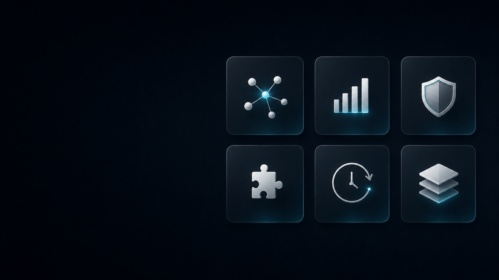

- Issue specifications and issue comments
- Pull request review comments
- Linked merged pull requests
- Code review impact incentives
- Code simplification incentives
- Priority and task reward labels
- Assignment-aware filtering to reduce gaming
- XP mode, ERC20 permits, and direct transfer mode

---

# Current Architecture

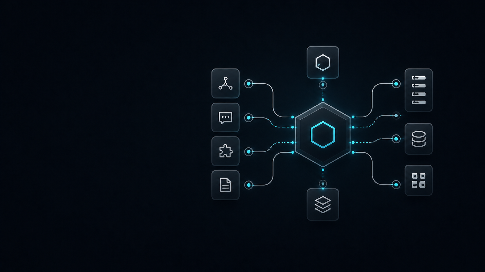

- `UserExtractorModule` identifies contributors
- `DataPurgeModule` removes commands, hidden comments, quotes, and gaming-prone content
- `ExternalContentProcessor` summarizes linked text and images
- `FormattingEvaluatorModule` scores structure, words, and readability

- `ContentEvaluatorModule` scores relevance with an LLM
- `ReviewIncentivizerModule` rewards useful code review
- `SimplificationIncentivizerModule` rewards net code reduction
- `PaymentModule` records XP or generates payouts
- `GithubCommentModule` posts the audit trail

---

# Scoring Philosophy

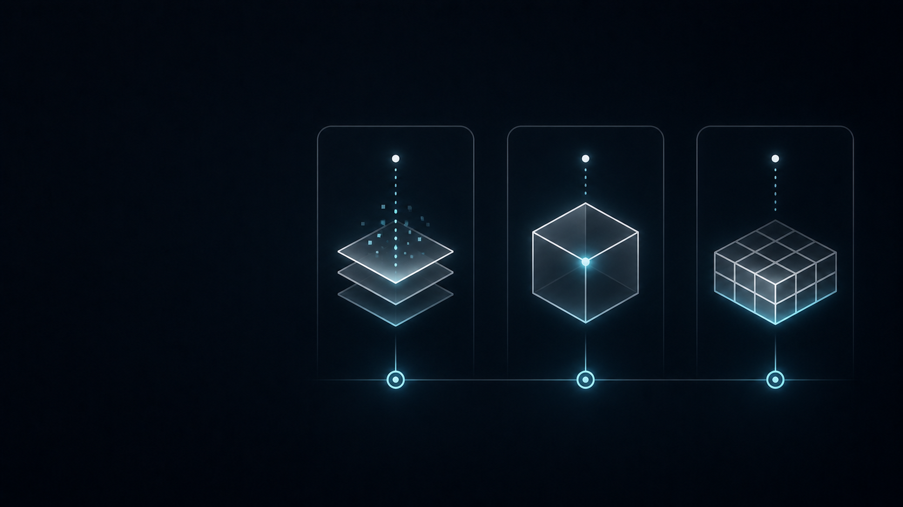

- Score evidence, not raw activity
- Count contribution type, role, relevance, priority, and authorship
- Avoid rewarding message volume
- Cap or weight rewards by task policy
- Keep every result linked to the original artifact

  

Evidence

Every score links back to source work.

  

Policy

Each org controls how work is weighted.

  

Ledger

XP and payouts become auditable records.

---

# Slack Expansion

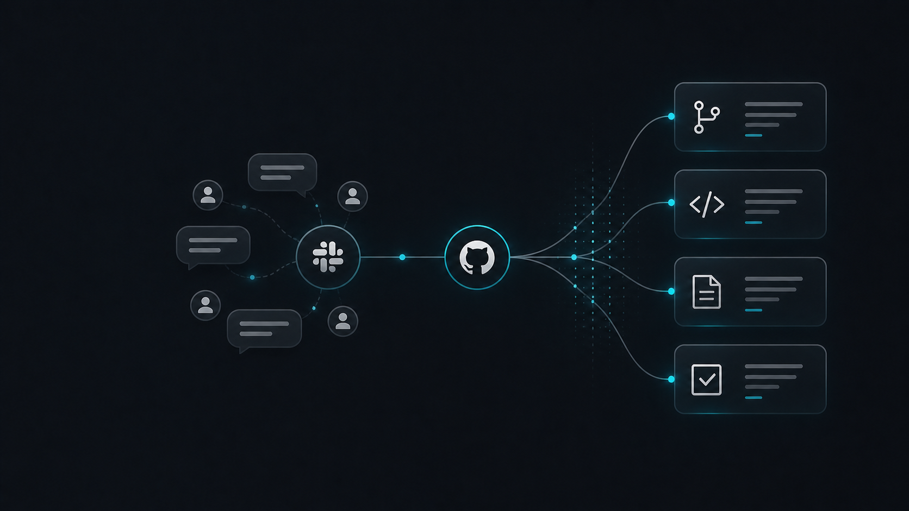

Slack should count only when it is tied to work.

- Thread linked to a GitHub issue or PR
- Decision summary
- Unblocker that resolves a task
- Incident coordination
- Customer or product context that changes implementation

No points for raw message count.

---

# Enterprise Dashboard

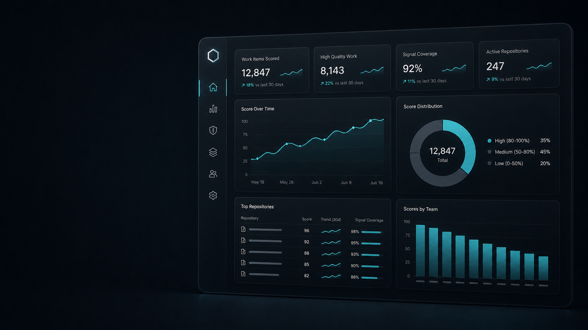

A system of record for engineering contribution evidence.

- Individual contribution ledger
- Team contribution distribution
- Review load and review value
- XP by work type
- Pending and claimed rewards

- Evidence drilldown to GitHub and Slack
- Manager-ready review packets
- Exportable audit reports
- Custom scoring policy
- Organization-level rollups

---

# Competitive Advantage

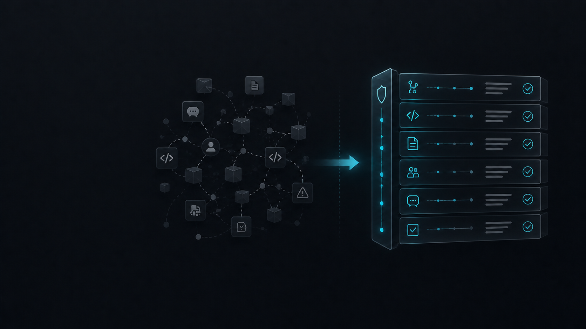

Most engineering intelligence tools sell dashboards.

UbiquityOS sells an incentive ledger.

- Artifact-level attribution, not just aggregate trends
- Explainable XP, not opaque productivity scoring
- Rewards and payouts, not just reporting
- Plugin architecture, not a closed workflow
- GitHub-native audit trail, not a detached analytics layer

---

# Ideal Customers

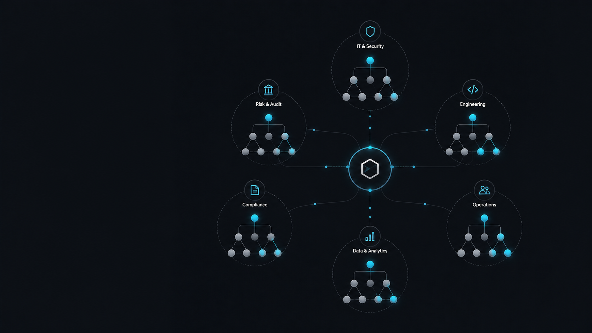

- GitHub-first engineering organizations
- Open-source programs
- Teams with contractors or external contributors
- Developer experience teams
- Engineering operations teams
- AI-forward teams that need better review visibility
- Distributed teams where async contribution matters

---

# Business Model

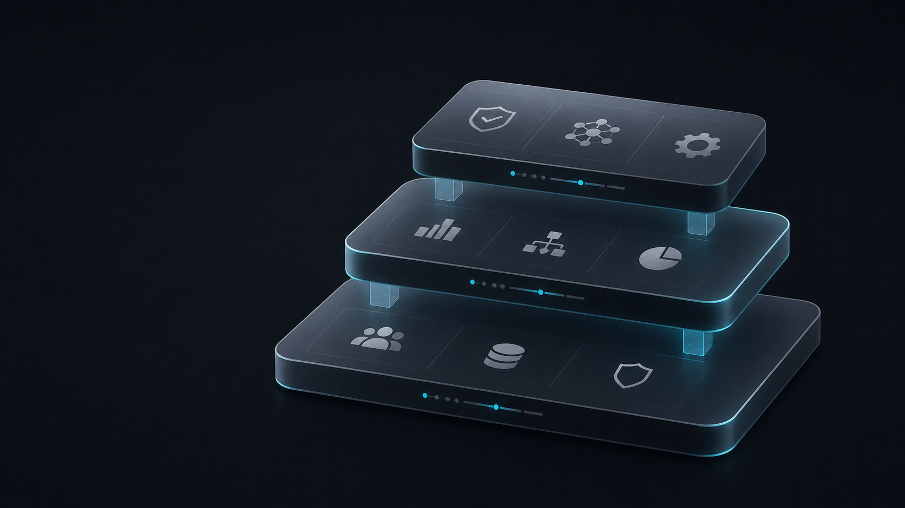

## Packaging

- Team: GitHub contribution ledger and XP dashboard
- Business: GitHub plus Slack, reports, and manager packets
- Enterprise: SSO, RBAC, audit exports, private deployment, retention controls, and custom scoring policy

## Pricing

- Per active contributor per month
- Platform fee plus usage-based AI evaluation
- Optional payout or permit fee
- Enterprise annual contracts

---

# Roadmap

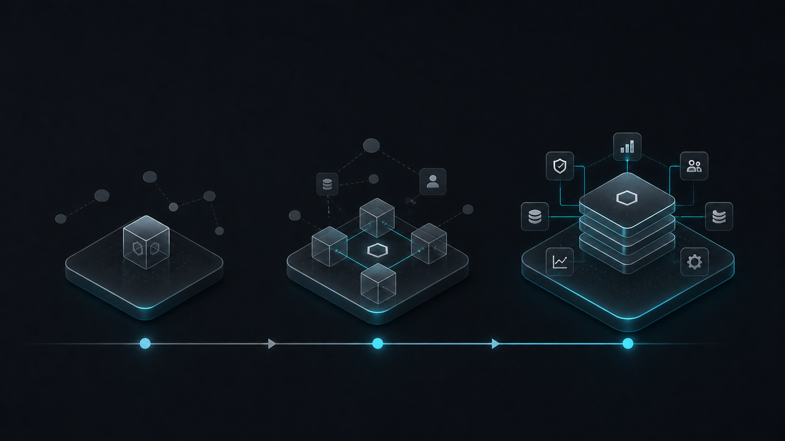

## Now

- GitHub event ingestion
- Contribution scoring
- XP and reward generation
- GitHub-native audit comments

## Next

- Enterprise dashboard
- Organization-level rollups
- Slack thread association
- Contribution ledger search and exports

## Later

- Jira and Linear association
- Manager review packets
- Custom enterprise scoring policies
- Benchmarking and governance reports

---

# Positioning

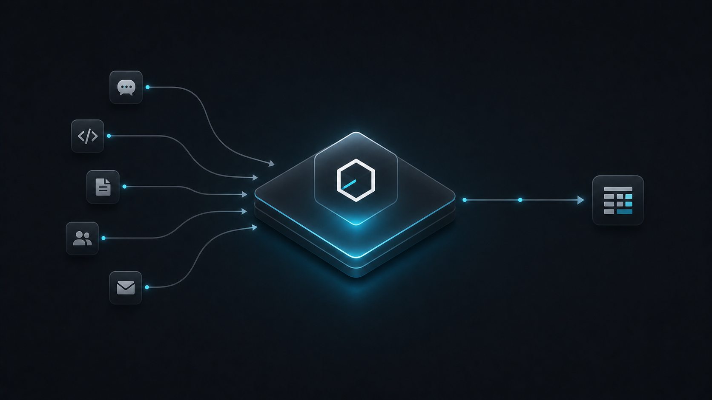

  
The contribution ledger for software teams.

  
UbiquityOS turns GitHub and collaboration activity into explainable XP, so enterprises can reward the work that actually moves software forward.

